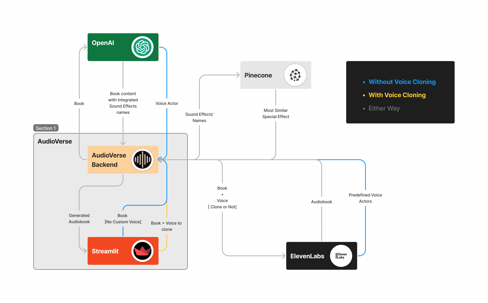

# AudioVerse - Breathe Life Into Your Books! 📚🌱
[](https://app.100.builders/directory)
[![](https://img.shields.io/badge/Official_Selection-Artizen_Season_3-1acc6c?logo=image/svg+xml;base64,PHN2ZyB4bWxucz0naHR0cDovL3d3dy53My5vcmcvMjAwMC9zdmcnIHdpZHRoPSc2NCcgaGVpZ2h0PSc2NCcgZmlsbD0nI2ZmZicgdmlld0JveD0nMCAwIDE2MCAxMjgnPjxwYXRoIGQ9J00xNTkuODk2IDExOC45ODRDMTU5Ljg5NiAxMTYuODgxIDE1OC4wODggMTE1LjA3OCAxNTUuOTc5IDExNS4wNzhDMTQ0LjAyOCAxMTUuMDc4IDEzMi4xNzggMTEzLjU3NiAxMjEuMDMxIDEwOS43NzFDMTE1LjEwNiAxMDcuNzY5IDEwOS4yODEgMTA0Ljc2NSAxMDQuMzYgMTAwLjc1OUMxMTQuNzA0IDkxLjg0NzUgMTIzLjU0MSA4MS4zMzM1IDEyOS43NjggNjkuMTE3MkMxMzIuODgxIDYyLjkwOSAxMzUuMzkyIDU1Ljg5OTcgMTM0LjQ4OCA0OC43OTAyQzEzMy4wODIgMzguNDc2NSAxMjQuNTQ2IDMyLjQ2ODUgMTE0LjUwMyAzMS44Njc3Qzk4LjIzNCAzMC41NjYgODQuMDczOSAzOS45Nzg1IDc3LjE0NDQgNTQuMzk3N0M3My43Mjk5IDYxLjQwNyA3Mi4yMjM1IDY5LjMxNzUgNzIuNzI1NyA3Ny4xMjc5QzczLjEyNzQgODUuNjM5MiA3Ni4xNDAyIDkzLjY0OTkgODAuODYwMiAxMDAuNDU5QzY4LjcwODYgMTA4LjA2OSA1NC44NDk4IDExMi44NzUgNDAuNjg5NyAxMTIuOTc2QzM3LjE3NDcgMTEyLjk3NiAzMy41NTk0IDExMi43NzUgMzAuMTQ0OSAxMTIuMDc0QzI2LjkzMTIgMTExLjM3MyAyMy43MTc2IDExMC4wNzIgMjEuNDA3OCAxMDcuNzY5QzE2LjY4NzcgMTAyLjg2MiAxNy4zOTA3IDk1LjY1MjUgMTguOTk3NiA4OS4xNDM5QzIyLjkxNDIgNzUuMTI1MiAzMS43NTE3IDYyLjYwODYgNDEuNTkzNSA1MS44OTQzQzUxLjAzMzYgNDEuNzgwOSA2NC43OTIgMzAuNDY1OCA3OC45NTIxIDI2Ljk2MTJDODMuMzcwOSAyNS44NTk3IDg2LjU4NDUgMjIuMTU0OCA4Ny4yODc1IDE3LjY0ODhDODcuNDg4NCAxNS45NDY1IDg3LjY4OTIgMTQuMjQ0MiA4Ny42ODkyIDEyLjQ0MTlDODcuNjg5MiAxMC42Mzk1IDg3LjM4NzkgNy42MzU0NiA4Ny4wODY2IDUuNTMyNjZDODYuNDg0MSAyLjEyODEzIDgzLjM3MDkgLTAuMjc1MDY2IDc5Ljg1NTkgMC4wMjUzMzNDNzcuMDQ0IDAuMjI1NiA3NC4yMzIxIDAuNzI2MjY2IDcxLjUyMDYgMS40MjcyQzU0LjQ0ODEgNi4wMzMzMyA0MC4wODcxIDE4LjA0OTMgMjguNzM4OSAzMS4wNjY2QzE0LjM3NzkgNDcuNjg4NyAwLjgyMDM3MyA3MS4yMiAwLjAxNjk2MjMgOTMuNjQ5OUMtMC4zODQ3NDMgMTA4LjI2OSA2LjM0MzgyIDEyMC43ODYgMjAuNzA0OCAxMjUuNTkyQzI1LjcyNjEgMTI3LjI5NSAzMS4wNDg3IDEyNy44OTUgMzYuMjcwOSAxMjcuOTk2QzU1LjY1MzIgMTI4LjE5NiA3NC40MzI5IDEyMS41ODcgOTAuNTAxMSAxMTEuMTczQzkzLjgxNTIgMTEzLjk3NyA5Ny41MzEgMTE2LjM4IDEwMS40NDggMTE4LjI4M0MxMTcuMzE1IDEyNi4zOTMgMTM1LjM5MiAxMjcuOTk2IDE1Mi44NjYgMTI3Ljc5NUMxNTMuNzcgMTI3Ljc5NSAxNTQuODc0IDEyNy43OTUgMTU1Ljk3OSAxMjcuNzk1QzE1OC4xODkgMTI3Ljc5NSAxNjAuMDk3IDEyNS45OTMgMTU5Ljk5NiAxMjMuNzlWMTE4Ljk4NEgxNTkuODk2Wk05Mi4yMDg0IDgyLjEzNDZDODkuMzk2NSA2OS45MTgzIDk1LjYyMjkgNTUuMDk4NiAxMDguMTc2IDUxLjQ5MzhDMTEwLjI4NSA1MC44OTMgMTEyLjU5NSA1MC41OTI2IDExNC44MDQgNTAuNjkyN0MxMTUuMzA2IDUwLjY5MjcgMTE1LjgwOSA1MC43OTI5IDExNi4yMSA1MC44OTNDMTE2LjYxMiA1MC45OTMxIDExNi44MTMgNTEuMDkzMyAxMTcuMTE0IDUxLjM5MzdDMTE3LjgxNyA1Mi4wOTQ2IDExNy41MTYgNTMuNzk2OSAxMTcuNDE1IDU1LjA5ODZDMTE2LjkxMyA1OC41MDMxIDExNS41MDcgNjIuMzA4MiAxMTMuOCA2NS41MTI1QzEwOS4wOCA3NC4yMjQgMTAyLjU1MiA4Mi41MzUxIDk0LjkxOTkgODkuNTQ0NEM5My43MTQ4IDg3LjI0MTQgOTIuODExIDg0LjczOCA5Mi4yMDg0IDgyLjEzNDZaJy8+PC9zdmc+&labelColor=464646&style=for-the-badge)](https://www.artizen.fund/)


[](https://github.com/Fatma-Chaouech/audioverse/graphs/contributors)
[](https://github.com/Fatma-Chaouech/audioverse/network/members)
[](https://github.com/Fatma-Chaouech/audioverse/stargazers)
[](https://github.com/Fatma-Chaouech/audioverse/blob/main/LICENSE)
[](https://github.com/Fatma-Chaouech/audioverse/issues)


Are you tired of reading books the traditional way? 😩 Experience a whole new world of literary immersion with [AudioVerse](https://audioverse.streamlit.app/)! 🎧📚 AudioVerse allows you to effortlessly transform any written material into captivating audiobooks, complete with customizable language, cloned voices, and exciting sound effects. 🌟🎙️💥

## Table of Contents
- [AudioVerse - Breathe Life Into Your Books! 📚🌱](#audioverse---breathe-life-into-your-books-)
  - [Table of Contents](#table-of-contents)
  - [🌟 Why AudioVerse?](#-why-audioverse)
  - [👀 Sneak Peek - Demo](#-sneak-peek---demo)
  - [🛠️ Technologies That Power Us](#️-technologies-that-power-us)
  - [🏭 Architecture Snapshot](#-architecture-snapshot)
  - [💻 Installation](#-installation)
  - [👩‍💻 Usage](#-usage)
  - [👋 Meet Our Team](#-meet-our-team)
    - [Fatma "PinkPanther" Chaouech](#fatma-pinkpanther-chaouech)
    - [Mohamed Nour "RedLion" Bessadok](#mohamed-nour-redlion-bessadok)
  - [🚀 Features and Challenges](#-features-and-challenges)
    - [🎟️ Features in the Pipeline](#️-features-in-the-pipeline)
    - [🔍 Challenges to Tackle](#-challenges-to-tackle)
  - [🙌 How You Can Contribute](#-how-you-can-contribute)

## 🌟 Why AudioVerse?

Get ready to transform your reading experience! With AudioVerse, you're not just reading – you're immersing yourself in a symphony of words, emotions, and soundscapes. Here's what makes us unique:

- **Effortless Conversion:** No more boring texts! Convert your favorite books into mesmerizing audiobooks with just a click.

- **Voice of Your Choice:** Pick the narrator that resonates with your soul. Our automatic voice selection makes every story come alive.

- **Your Personal Touch:** Want your audiobook to sound like you? Engage our personalized voice cloning for a one-of-a-kind listening adventure.

- **Sound Effects Magic:** Get ready for an immersive journey! We automatically integrate sound effects to elevate your storytelling experience.

## 👀 Sneak Peek - Demo
Here are some generated examples:

| Input Text          | Voice Name          | Cloning Voice Sample           | Generated Audio 🔊 |
| :------------ | :-----------------: | :-----------------------------: | :----------------: |
| With an unsettling urgency, the figure checked their phone, the device casting a dim glow on their features. A call interrupted the solitude... | Andrew Huberman |  |  |
| Brunson, a hefty fellow, was far from bashful when it came to throwing his weight around. One fateful day, ... | Dynamically Selected Voice | ❌ |  |

Curious to see how the magic works? Check out our demo [here](https://github.com/Fatma-Chaouech/audioverse/assets/69005550/3d25a540-393d-4a3e-b799-a8d9826c74b9), or try it yourself on our [Demo Website](https://audioverse.streamlit.app/).


## 🛠️ Technologies That Power Us
- **ElevenLabs**
- **OpenAI** 
- **Streamlit** 
- **Pinecone** 

## 🏭 Architecture Snapshot


## 💻 Installation
1. Clone the repository
    ```
    git clone https://github.com/Fatma-Chaouech/audioverse.git
    ```
2. Create a virtual environment
   ```
   cd audioverse
   python -m venv myenv
   ```
3. Activate the virtual environment
    ```
    # on Windows  
    myenv\Scripts\activate

    # on macOS and Linux
    source myenv/bin/activate
    ```
5. Install the dependencies
    ```
    pip install -r requirements.txt
    ```
6. Install [ffmpeg](https://www.videoproc.com/resource/how-to-install-ffmpeg.htm) if you don't already have it
   ```
   # On Linux
   sudo apt update
   sudo apt install ffmpeg
   ```
7. Create a .env file (see the [.env.template](./.env.template))

## 👩‍💻 Usage
1. Run streamlit server
    ```
    streamlit run app.py
    ```
2. Open your web browser and navigate to [http://localhost:8501](http://localhost:8501)
3. Follow the Guiding Form
4. Give our magic a moment to weave its spell
5. Download your audiobook

## 👋 Meet Our Team

🎉 We're the dynamic duo behind the scenes, shaping AudioVerse with passion, innovation, and a sprinkle of quirkiness! 🎙️🛠️

### Fatma "PinkPanther" Chaouech
🧠 **Role:** Builder Extraordinaire

If you ever spot a trail of code leading to awesomeness, it's likely Fatma's work. As a software engineering student with a builder's mentality, she thrives on turning ideas into vibrant projects. With an unwavering belief in open source magic, she's constantly weaving creativity and code. Interested in the AI-neuroscience blend, she's bridging the gap between machines and minds.

🌐 **Connect:** [Github](https://github.com/Fatma-Chaouech) | [LinkedIn](https://www.linkedin.com/in/fatma-chaouech/) | [Twitter](https://twitter.com/FatmaChaouech_) (or X?)

🐾 **Fun Fact:** She's known as the "PinkPanther" – a fusion of her love for mystery and a dash of pink flair.

### Mohamed Nour "RedLion" Bessadok
🧐 **Role:** Problem Solving Guru

Meet the mind that navigates the labyrinth of challenges – Nour is the Sherlock of our team. With a knack for critical thinking, he's our puzzle solver, spotting issues before they even think of hiding. Driven by an insatiable thirst for knowledge, he feasts upon the banquet of Math and Physics, and now AI has taken its prestigious place on the menu.

🌐 **Connect:** [Github](https://github.com/Mohamed-Nour-Bessadok) | [LinkedIn](https://www.linkedin.com/in/mohamed-nour-bessadok-34446b251/)

🔥 **Fun Fact:** Fueled by ambition, the "RedLion" is on the prowl.

## 🚀 Features and Challenges 

We're on a journey to create the ultimate audiobook experience with AudioVerse. While we've come a long way, there are still exciting features to be built and challenges to overcome. We believe in the power of community collaboration, and we invite you to join us on this adventure!

### 🎟️ Features in the Pipeline

- **Enhanced Narrator Variety:** Elevate the storytelling experience by seamlessly switching between different voices, perfect for dialogues and diverse characters within the same audiobook.

- **Language Magic:** Expand language support to bring audiobooks to a global audience. Unleash the magic of storytelling in multiple languages!

- **Add File Parsers:** We currently support pdfs and txt files. We're working to enhance compatibility by adding support for additional file formats.

### 🔍 Challenges to Tackle 

- **Optimizing Audiobook Generation Pipeline:** The audiobook generation process takes a significant amount of time as the size of the book increases. We're exploring ways to optimize this process, whether by reducing the number of calls made to OpenAI and ElevenLabs or by experimenting with alternative models like Stability AI or Meta's models.

- **Enriching Sound Effects:** Currently, the accuracy of sound effect insertion varies due to a limited database. We're on a mission to create a comprehensive sound effects library, categorized by topics. Additionally, we're exploring the use of text-to-sound models to generate unique and accurate sound effects.

- **Enhancing Book Parsing:** We're exploring optimal methods for extracting the content from books, such as skipping elements like the table of contents.

## 🙌 How You Can Contribute

If you're passionate about any of the features or challenges mentioned above, or if you have your own ideas to bring to the table, we welcome your contributions!

Here's how you can get involved:

1. **Fork the Repository:** Start by forking our repository to your GitHub account.

2. **Create a Branch:** Create a new branch for your contributions, ensuring that your work doesn't interfere with the main codebase.

3. **Make Your Magic:** Work on your chosen feature or challenge, keeping in mind best coding practices.

4. **Submit a Pull Request:** Once your code is ready, submit a pull request. We'll review your work and provide feedback.

5. **Celebrate Collaboration:** By contributing, you're becoming a part of the AudioVerse community. Your contributions make a real impact!

**Join us on this exciting journey of innovation and creativity. Let's turn words into symphonies together!** 🎶🚀
